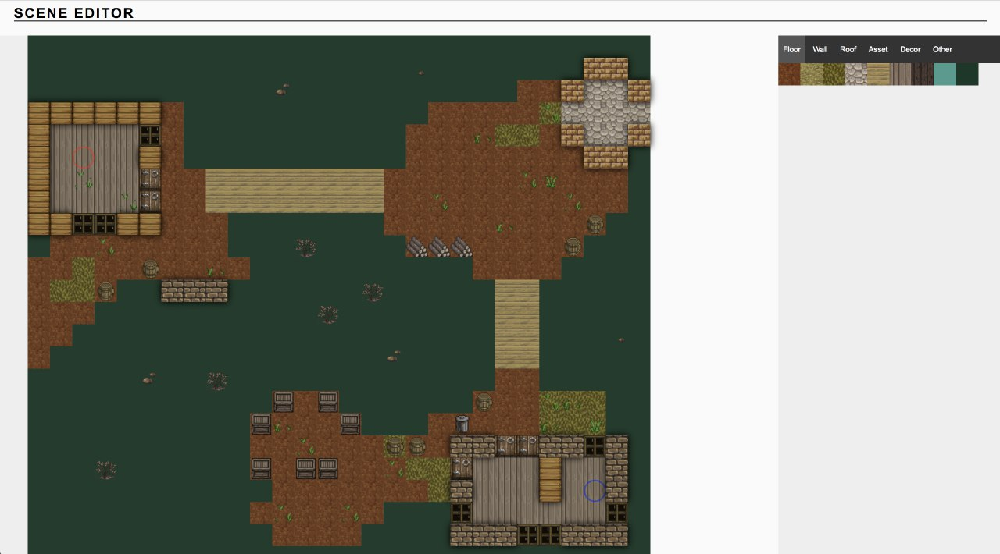

# Tactics multiplayer game ( VueJs )

> Create a server instance in browser, join to server from browser - play!

###Features:
* WebRTC -based 2p2 connections
* VueJS as UI client engine
* Hand-written real-time multiplayer game engine ( 100 frames per second, tested with 8 players online )
* Destructible environment
* Levels editor
* Full projectile travel simulation ( no hitscan ) in realtime

####Instructions
* Build and run project ( build instructions below )
* Open ui, navigate to "Editor" tab
* Use editor to create a level


* Open ui, navigate to "Server" tab and create a server instance


* It will give you unique WebRTC connection token


* Open another browser instance, open ui (it's IMPORTANT to open new instance as otherwise browser will limit cpu usage for server and it won't be fast)
* Input connection token of your server and connect
* Choose team and weapon - game starts once there's at least 1 team member per each team


## Build Setup

``` bash
# install dependencies
npm install

# serve with hot reload at localhost:8080
npm run dev

# build for production with minification
npm run build

# run unit tests
npm run unit

# run e2e tests
npm run e2e

# run all tests
npm test
```
