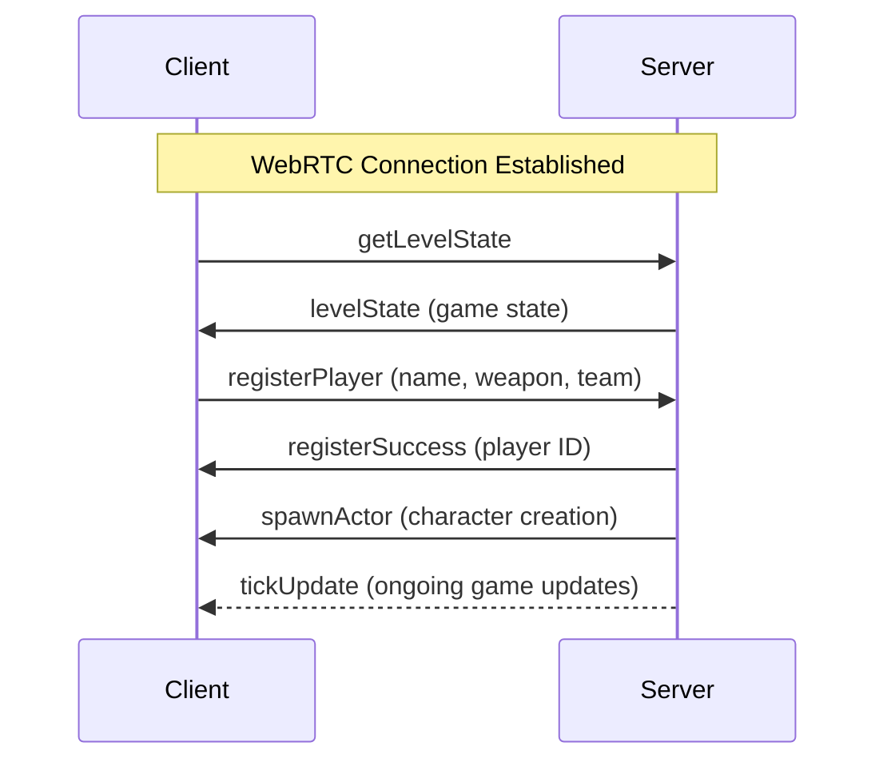
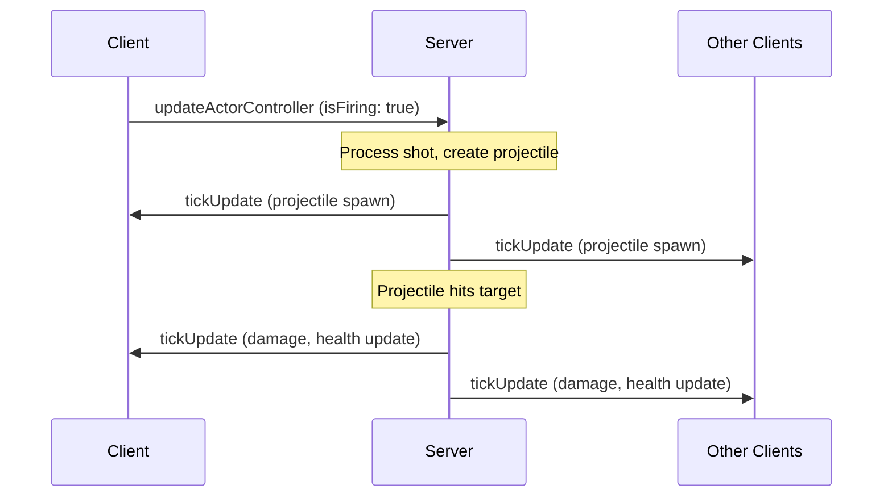

# Client-Server Communication

The communication protocol in Tactics Clash 2D defines how clients and the server (host player) exchange messages over WebRTC data channels. All communication follows a JSON-based message format with specific actions and data payloads.

## Message Protocol

### Standard Message Format
All messages follow this structure:
```javascript
{
    action: "messageType",
    data: {
        // Message-specific payload
    }
}
```

### Message Categories
- **Connection**: Initial handshake and connection management
- **Registration**: Player joining and team selection  
- **Game State**: Level state and real-time updates
- **Player Actions**: Input and control updates
- **Session**: Game phase transitions and scoring

## Client-to-Server Messages

### Connection Messages

#### `getLevelState`
**Purpose**: Request initial game state upon connection
```javascript
{
    action: 'getLevelState',
    data: {} // No payload
}
```

**When Sent**: Immediately after WebRTC connection established

### Registration Messages

#### `registerPlayer`
**Purpose**: Join the game with team and weapon selection
```javascript
{
    action: 'registerPlayer',
    data: {
        name: "PlayerName",      // Player display name
        weapon: "assaultRifle",  // Selected weapon type
        team: "red"              // Team selection: "red" or "blue"
    }
}
```

**Validation Rules**:
- `name` must be non-empty string
- `weapon` must exist in `availableWeapons`
- `team` must be "red" or "blue"

### Input Messages

#### `updateActorController`
**Purpose**: Send player input controls to server
```javascript
{
    action: 'updateActorController',
    data: {
        isMovingForward: false,
        isMovingRight: false,
        isMovingLeft: false,
        isMovingBackwards: false,
        isSprinting: false,
        isFiring: false,
        isReloading: false,
        // Aim direction set via facePotentialPosition()
    }
}
```

**Update Frequency**: Sent when controls change (throttled client-side)

## Server-to-Client Messages

### Connection Response Messages

#### `levelState`
**Purpose**: Send complete game state to newly connected client
```javascript
{
    action: 'levelState',
    data: {
        levelParams: {
            maxPlayers: 8,
            redTeamName: "Red Team",
            blueTeamName: "Blue Team"
        },
        availableWeapons: {
            "assaultRifle": true,
            "shotgun": true,
            "sniper": true
            // ... other weapons
        },
        actors: {
            "playerId1": {
                x: 100,
                y: 200,
                rotation: 1.57,
                health: 100,
                maxHealth: 100,
                ammo: 30,
                maxAmmo: 30,
                isDead: false
            }
            // ... other players
        },
        projectiles: [],
        level: {
            // Level geometry and obstacles
        }
    }
}
```

### Registration Response Messages

#### `registerSuccess`
**Purpose**: Confirm successful player registration
```javascript
{
    action: 'registerSuccess',
    data: {
        id: "uniquePlayerId"  // Server-assigned player ID
    }
}
```

### Player Management Messages

#### `playerConnected`
**Purpose**: Notify all clients when a new player joins
```javascript
{
    action: 'playerConnected',
    data: {
        id: "playerId",
        name: "PlayerName"
    }
}
```

#### `playerDisconnected`
**Purpose**: Notify all clients when a player leaves
```javascript
{
    action: 'playerDisconnected',
    data: {
        id: "playerId"
    }
}
```

#### `spawnActor`
**Purpose**: Create a player character in the game world
```javascript
{
    action: 'spawnActor',
    data: {
        id: "playerId",
        x: 150,              // Spawn position X
        y: 300,              // Spawn position Y
        team: "red",         // Player team
        weaponKey: "assaultRifle",
        actorKey: "soldier"
    }
}
```

### Real-time Update Messages

#### `tickUpdate`
**Purpose**: Send real-time game state changes (67 FPS)
```javascript
{
    action: 'tickUpdate',
    data: {
        actors: {
            "playerId1": {
                x: 105,           // Updated position
                y: 203,
                rotation: 1.60,   // Updated facing direction  
                health: 95,       // Current health
                ammo: 28,         // Current ammo
                isDead: false
            }
            // Only includes actors with changes
        },
        projectiles: [
            {
                id: "proj_123",
                x: 250,
                y: 180,
                velocityX: 5.2,
                velocityY: -1.8,
                damage: 25,
                ownerId: "playerId1"
            }
        ],
        levelChanges: {
            // Destructible environment updates
        }
    }
}
```

**Update Frequency**: Every 15ms (game tick rate)

### Session Management Messages

#### `gameSessionState`
**Purpose**: Notify clients of game phase changes
```javascript
{
    action: 'gameSessionState',
    data: "play"  // Values: "lobby", "play", "finish"
}
```

#### `sessionScore`
**Purpose**: Send final scores and winner
```javascript
{
    action: 'sessionScore',
    data: {
        scores: {
            "playerId1": 3,   // Kill count
            "playerId2": 1,
            "playerId3": 0
        },
        winTeam: "red"        // Winning team
    }
}
```

## Message Handlers

### Server Message Handlers
```javascript
messageHandlers = {
    'getLevelState': (connRef) => {
        connRef.send({
            action: 'levelState',
            data: this.formatGameState(connRef)
        });
    },
    
    'registerPlayer': (connRef, data, req) => {
        if (this.validateRegistration(data)) {
            this.processRegistration(connRef, data);
        }
    },
    
    'updateActorController': (connRef, data) => {
        connRef.updateControls(data);
    }
};
```

### Client Message Handlers
```javascript
messageHandlers = {
    'levelState': (data) => {
        this.levelRef.setState(data);
        this.levelParams = data.levelParams;
        this.availableWeapons = data.availableWeapons;
        this.stage = this.stages[1]; // Move to register stage
    },
    
    'registerSuccess': (data) => {
        this.serverId = data.id;
        this.stage = this.stages[2]; // Move to play stage
    },
    
    'playerConnected': (data) => {
        this.players[data.id] = {
            id: data.id,
            name: data.name
        };
    },
    
    'playerDisconnected': (data) => {
        this.removeActor(data);
        delete this.players[data.id];
    },
    
    'spawnActor': (data) => {
        this.players[data.id] = this.players[data.id] || {id: data.id};
        Vue.set(this.players[data.id], 'team', data.team);
        this.spawnActor(data);
    },
    
    'tickUpdate': (data) => {
        this.handleTick(data);
    },
    
    'gameSessionState': (data) => {
        this.gameSessionState = data;
    },
    
    'sessionScore': (data) => {
        Object.keys(data.scores).forEach(pid => {
            this.players[pid].score = data.scores[pid];
        });
        this.winTeam = data.winTeam;
    }
};
```

## Message Flow Examples

### Player Connection Sequence


### Combat Action Sequence


## Data Validation

### Server-Side Validation
```javascript
validateRegistration(data) {
    return data.name && 
           data.weapon && 
           this.availableWeapons[data.weapon] &&
           data.team && 
           this.teamMembers[data.team];
}
```

### Input Sanitization
- **String Limits**: Player names limited to reasonable length
- **Enum Validation**: Weapons and teams validated against allowed values
- **Rate Limiting**: Control updates throttled to prevent spam
- **Range Checking**: Numeric values validated for reasonable ranges

## Error Handling

### Connection Errors
```javascript
conn.on('error', (err) => {
    console.error('Connection error:', err);
    this.handleConnectionError(conn, err);
});
```

### Message Processing Errors
```javascript
handleClientMessage(connRef, req) {
    try {
        if (this.messageHandlers[req.action]) {
            this.messageHandlers[req.action](connRef, req.data, req);
        } else {
            console.warn('Unknown message action:', req.action);
        }
    } catch (error) {
        console.error('Message processing error:', error);
    }
}
```

### Invalid Messages
- **Unknown Actions**: Logged and ignored
- **Malformed Data**: Rejected with error logging
- **Validation Failures**: Client notified of rejection reason

## Performance Considerations

### Message Optimization
- **Delta Updates**: Only changed data in tick updates
- **Message Batching**: Multiple updates per WebRTC message
- **Compression**: JSON structure minimized for common messages

### Throttling Mechanisms
```javascript
const updateControlsDebounce = 20; // 20ms minimum between input updates

updateControls(data) {
    this._updateCtrlData = data;
    if (!this._updateCtrlInterval) {
        this.actor.controller.setSerializable(this._updateCtrlData);
        this._updateCtrlInterval = setTimeout(
            () => this._updateCtrlInterval = null, 
            updateControlsDebounce
        );
    }
}
```

### Bandwidth Management
- **Control Throttling**: Input updates limited to 50 FPS
- **State Deltas**: Only modified actors sent in updates
- **Message Priorities**: Critical messages sent immediately
- **Connection Monitoring**: Detect and handle bandwidth limitations

This communication protocol provides reliable, efficient data exchange while maintaining real-time performance for smooth multiplayer gameplay.