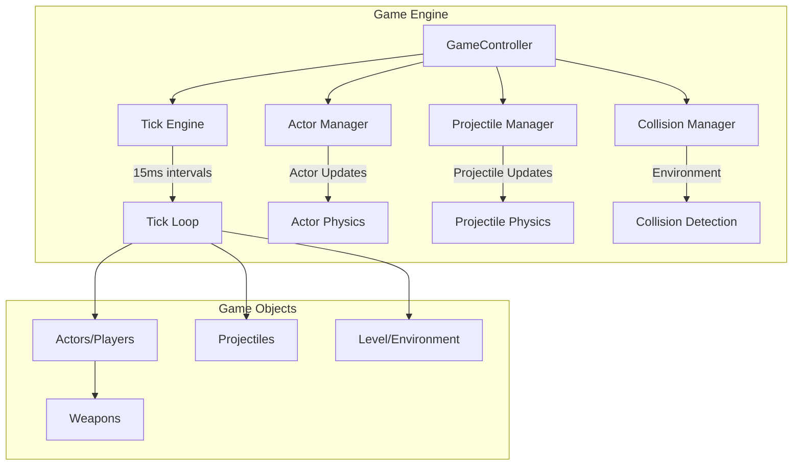

# Game Engine

The Tactics Clash 2D game engine provides the core gameplay mechanics, running at 67 FPS (15ms ticks) on the server to ensure consistent, authoritative game simulation. The engine handles physics, combat, collision detection, and environmental destruction.

## Engine Architecture

### Core Components


### GameController Class
```javascript
export class GameController {
    _tickInterval;
    _level;
    isRunning = false;
    isProcessingTick = false;
    tickTimePeriod = TICKMS; // 15ms
    actors = [];
    projectiles = [];
    doOnTick = [];
}
```

## Game Loop

### Tick System
```javascript
const TICKMS = 15; // 15ms = ~67 FPS

start() {
    this.stop();
    this._tickInterval = setInterval(this.tickMaybe.bind(this), this.tickTimePeriod);
}

tickMaybe() {
    if (!this.isProcessingTick) {
        this.tick();
    }
}

tick() {
    this.isProcessingTick = true;
    
    // Update all projectiles
    this.projectiles.forEach(this.tickProjectile.bind(this));
    
    // Update all actors
    this.actors.forEach(this.tickActor.bind(this));
    
    // Execute scheduled callbacks (networking, etc.)
    this.doOnTick.forEach(todo => todo());
    
    this.isProcessingTick = false;
}
```

**Key Features**:
- **Fixed Timestep**: Consistent 15ms intervals for predictable physics
- **Skip Protection**: Prevents multiple simultaneous ticks
- **Callback System**: `doOnTick` array for synchronized operations
- **Performance Monitoring**: Tracks tick processing time

## Actor System

### Actor Properties
```javascript
class Actor {
    x, y;                    // Position coordinates
    rotation;                // Facing direction (radians)
    health, maxHealth;       // Health system
    ammo, maxAmmo;          // Ammunition system
    isDead;                  // Death state
    controller;              // Input controller
    weapon;                  // Equipped weapon
    team;                    // Team assignment
    characterName;           // Player name
}
```

### Actor Tick Processing
```javascript
tickActor(actor) {
    if (!actor.isDead) {
        actor.tickCooldowns();
        
        // Movement processing
        if (actor.controller.isMovingForward) {
            actor.stepForward(this._level.collisions);
        }
        if (actor.controller.isMovingRight) {
            actor.stepRight(this._level.collisions);
        }
        if (actor.controller.isMovingLeft) {
            actor.stepLeft(this._level.collisions);
        }
        if (actor.controller.isMovingBackwards) {
            actor.stepBackwards(this._level.collisions);
        }
        
        // Update facing direction
        actor.faceFromPotential();
        
        // Combat actions
        if (actor.controller.isReloading) {
            actor.actionReload();
        } else if (actor.controller.isFiring) {
            actor.actionFire();
        }
    }
}
```

### Movement System
- **Collision-Based**: Movement checked against level geometry
- **Multi-Directional**: Support for 8-directional movement
- **Speed Modifiers**: Sprinting affects movement speed
- **Smooth Rotation**: Continuous facing direction updates

### Combat System
- **Weapon-Based**: Different weapons with unique properties
- **Ammo Management**: Limited ammunition with reload mechanics
- **Cooldowns**: Prevent spam shooting and actions
- **Team-Based**: Friendly fire and team identification

## Projectile System

### Projectile Physics
```javascript
tickProjectile(projectile) {
    projectile.move(this._level.hitCollisions);
}
```

**Ballistic Simulation Features**:
- **No Hitscan**: Projectiles travel through space over time
- **Physics-Based**: Velocity, gravity, and trajectory calculation
- **Collision Detection**: Against environment and players
- **Damage Application**: On impact with targets

### Projectile Properties
```javascript
class Projectile {
    x, y;                    // Current position
    velocityX, velocityY;    // Movement vector
    damage;                  // Damage on impact
    ownerId;                 // Shooter identification
    lifetime;                // Time until destruction
    size;                    // Collision radius
}
```

### Projectile Lifecycle
1. **Spawn**: Created when weapon fires
2. **Travel**: Moves according to physics each tick
3. **Collision**: Checks for environment/player impacts
4. **Impact**: Applies damage and creates effects
5. **Destruction**: Removed from simulation

## Collision System

### Collision Types
- **Environment Collisions**: Static level geometry
- **Actor Collisions**: Player movement blocking
- **Projectile Collisions**: Bullet impact detection
- **Destructible Collisions**: Environment that can be destroyed

### Collision Detection
```javascript
// Movement collision checking
actor.stepForward(this._level.collisions);

// Projectile collision checking  
projectile.move(this._level.hitCollisions);
```

**Collision Methods**:
- **AABB**: Axis-Aligned Bounding Box for simple shapes
- **Pixel-Perfect**: Detailed collision for complex geometry
- **Sweep Testing**: Continuous collision detection for fast objects

## Level System

### Level Components
- **Static Geometry**: Non-destructible walls and obstacles
- **Destructible Blocks**: Environment that can be damaged
- **Spawn Points**: Player and item spawn locations
- **Boundaries**: Level limits and out-of-bounds areas

### Destructible Environment
```javascript
class Level {
    collisions;      // Static collision geometry
    hitCollisions;   // Destructible collision geometry
    blocks;          // Individual destructible blocks
}
```

**Destruction Mechanics**:
- **Block-Based**: Environment divided into destructible units
- **Damage Accumulation**: Blocks have health and take damage
- **Dynamic Updates**: Collision geometry updates when blocks destroyed
- **Visual Effects**: Destruction animations and particles

## Weapon System

### Weapon Types
```javascript
const weaponTypes = {
    assaultRifle: {
        damage: 25,
        fireRate: 0.1,      // Seconds between shots
        ammo: 30,
        reloadTime: 2.0,
        projectileSpeed: 800,
        accuracy: 0.95
    },
    shotgun: {
        damage: 15,
        fireRate: 0.8,
        ammo: 8,
        pelletCount: 5,     // Multiple projectiles per shot
        spread: 0.3
    },
    sniper: {
        damage: 100,
        fireRate: 2.0,
        ammo: 5,
        projectileSpeed: 1200,
        accuracy: 1.0
    }
};
```

### Weapon Mechanics
- **Fire Rate**: Cooldown between shots
- **Ammunition**: Limited ammo with reload system
- **Projectile Properties**: Speed, damage, spread
- **Unique Behaviors**: Shotgun spread, sniper precision

## Actor Controller System

### Input Processing
```javascript
class ActorController {
    isMovingForward = false;
    isMovingRight = false;
    isMovingLeft = false;
    isMovingBackwards = false;
    isSprinting = false;
    isFiring = false;
    isReloading = false;
    
    getSerializable() {
        // Return state for network transmission
    }
    
    setSerializable(data) {
        // Apply networked input state
    }
}
```

### Input Mapping
- **WASD Movement**: Standard FPS-style movement
- **Mouse Aiming**: Continuous aim direction
- **Mouse Buttons**: Fire and secondary actions
- **Keyboard Actions**: Reload, sprint, etc.

## Performance Optimization

### Tick Optimization
```javascript
tickMaybe() {
    if (!this.isProcessingTick) {
        this.tick();
    }
}
```

**Optimizations**:
- **Skip Prevention**: Avoid overlapping tick processing
- **Early Exit**: Skip updates for inactive objects
- **Spatial Partitioning**: Only check nearby objects for collisions
- **Object Pooling**: Reuse projectile objects

### Memory Management
- **Object Lifecycle**: Proper cleanup of destroyed objects
- **Array Management**: Efficient adding/removing of game objects
- **State Tracking**: Minimal state storage for synchronization
- **Garbage Collection**: Minimize allocations during gameplay

## Game States

### Engine States
- **Stopped**: Engine not running
- **Running**: Active game simulation
- **Paused**: Temporarily suspended (if needed)

### Level States
- **Loading**: Level geometry being prepared
- **Active**: Level ready for gameplay
- **Destroyed**: Level cleanup in progress

## Integration with Multiplayer

### Server Authority
```javascript
// Server tick callback for networking
this.levelRef.logic.doOnTick.push(this.handleTick.bind(this));

handleTick() {
    this.server.send({
        action: 'tickUpdate',
        data: this.formatGameUpdate()
    });
}
```

### Client Prediction
While not fully implemented, the architecture supports:
- **Input Prediction**: Apply movement immediately
- **Server Reconciliation**: Correct predictions on mismatch
- **Lag Compensation**: Account for network delays

## Error Handling

### Tick Errors
```javascript
tick() {
    try {
        this.isProcessingTick = true;
        // Game logic...
    } catch (error) {
        console.error('Tick error:', error);
    } finally {
        this.isProcessingTick = false;
    }
}
```

### Recovery Mechanisms
- **State Validation**: Check for corrupted game state
- **Object Cleanup**: Remove invalid game objects
- **Graceful Degradation**: Continue with reduced functionality

## Configuration

### Engine Constants
```javascript
const TICKMS = 15;              // Tick interval (ms)
const MAX_PROJECTILES = 100;    // Projectile limit
const MAX_ACTORS = 8;           // Player limit
const PHYSICS_ITERATIONS = 1;   // Physics simulation steps
```

### Tunable Parameters
- **Tick Rate**: Balance between performance and accuracy
- **Collision Precision**: Trade-off between accuracy and performance
- **Update Frequency**: Network update optimization
- **Object Limits**: Memory and performance constraints

The game engine provides a solid foundation for real-time multiplayer combat with predictable physics, responsive controls, and extensible architecture for future enhancements.