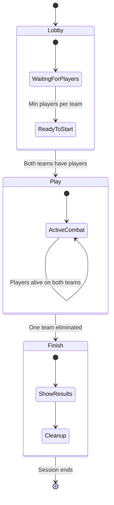

# Game Session Management

The game session management system in Tactics Clash 2D controls the flow of multiplayer matches through distinct phases: lobby, active play, and finish states. The `GameSessionController` handles player lifecycle, team management, and win conditions.

## Session States

### State Machine


## GameSessionController

### Core Properties
```javascript
export class GameSessionController {
    states = STATES;
    state = STATES.lobby;
    playerTeamMapping = {};        // Player ID -> Team mapping
    redTeamAlivePlayers = 0;       // Count of living red players
    blueTeamAlivePlayers = 0;      // Count of living blue players
    playerScores = {};             // Player ID -> Kill count
    latestWinTeam;                 // Winning team ('red' or 'blue')
}
```

### Session States Definition
```javascript
export const STATES = {
    lobby: 'lobby',    // Waiting for players to join
    play: 'play',      // Active gameplay
    finish: 'finish'   // Game over
};
```

## State Transitions

### 1. Lobby State
**Purpose**: Wait for sufficient players to start the game

**Entry Conditions**:
- Session just started
- Previous game finished

**Transition Logic**:
```javascript
lobby: () => {
    if (this.redTeamAlivePlayers && this.blueTeamAlivePlayers) {
        this.state = STATES.play;
        this.onplay();
        this.onstateChange(this.state);
    }
}
```

**Requirements for Play**:
- At least 1 player on Red team
- At least 1 player on Blue team

### 2. Play State  
**Purpose**: Active combat with real-time gameplay

**Entry Conditions**:
- Both teams have at least one player
- All players have selected weapons and spawned

**Transition Logic**:
```javascript
play: () => {
    if (!this.redTeamAlivePlayers || !this.blueTeamAlivePlayers) {
        this.latestWinTeam = this.redTeamAlivePlayers && 'red' || 'blue';
        this.state = STATES.finish;
        this.onfinish();
        this.onstateChange(this.state);
    }
}
```

**End Conditions**:
- All players on one team eliminated
- Host disconnects

### 3. Finish State
**Purpose**: Display results and cleanup

**Entry Conditions**:
- One team completely eliminated
- Game manually ended

**Behavior**:
```javascript
finish: () => {
    this.stop(); // End session monitoring
}
```

## Player Management

### Player Registration
```javascript
registerPlayer(player) {
    // Update team counts
    if (player.team === 'red') {
        this.redTeamAlivePlayers += 1;
    } else {
        this.blueTeamAlivePlayers += 1;
    }
    
    // Track player team and score
    this.playerTeamMapping[player.id] = player.team;
    this.playerScores[player.id] = 0;
}
```

**Registration Process**:
1. Player connects to server
2. Selects team (Red or Blue) and weapon
3. Server validates selection and spawns actor
4. Session controller updates team counts
5. Checks if game can start

### Player Removal
```javascript
removePlayer(player) {
    if (this.playerTeamMapping[player.id]) {
        delete this.playerTeamMapping[player.id];
        delete this.playerScores[player.id];
        
        // Decrease alive count if player wasn't dead
        if (!player.actor.isDead) {
            this[player.team + 'TeamAlivePlayers'] -= 1;
        }
    }
}
```

**Triggers for Removal**:
- Player disconnects
- Player manually leaves
- Network connection lost

## Team System

### Team Structure
- **Two Teams**: Red vs Blue
- **Team Balance**: No enforcement of equal team sizes  
- **Team Selection**: Players choose teams in lobby
- **Team Communication**: All players see all actions (no team-only chat)

### Team Victory Conditions
```javascript
// Win by elimination
if (!this.redTeamAlivePlayers) {
    this.latestWinTeam = 'blue';
} else if (!this.blueTeamAlivePlayers) {
    this.latestWinTeam = 'red';
}
```

### Scoring System
```javascript
handleKill(target, killer) {
    // Award point to killer
    this.playerScores[killer.connectionId] += 1;
    
    // Reduce team alive count
    this[this.playerTeamMapping[target.connectionId] + 'TeamAlivePlayers'] -= 1;
}
```

## Session Lifecycle

### 1. Session Start
```javascript
start() {
    this.stop();                    // Clear any existing session
    this.state = STATES.lobby;      // Begin in lobby
    this.onlobby();                 // Execute lobby callback
    this.onstateChange(this.state); // Notify state change
    
    // Start monitoring at 1000ms intervals
    this._interval = setInterval(this.checkState.bind(this), CHECKTS);
}
```

### 2. State Monitoring
The session controller continuously monitors conditions every 1000ms:
```javascript
checkState() {
    this.stateHandlers[this.state]();
}
```

### 3. Session End
```javascript
stop() {
    clearInterval(this._interval);  // Stop monitoring
}
```

## Event Callbacks

### State Change Events
```javascript
// Custom callbacks for different states
onlobby = () => {};      // Executed when entering lobby
onplay = () => {};       // Executed when game starts  
onfinish = () => {};     // Executed when game ends
onstateChange = () => {}; // Executed on any state change
```

### Server Integration
The `ServerController` sets up session callbacks:
```javascript
this.gameSession.onplay = () => {
    // Start game engine
    this.levelRef.logic.start();
    this.levelRef.logic.doOnTick.push(this.handleTick.bind(this));
};

this.gameSession.onfinish = () => {
    // Stop game engine and send results
    this.levelRef.logic.stop();
    this.server.send({
        action: 'sessionScore',
        data: {
            scores: this.gameSession.playerScores,
            winTeam: this.gameSession.latestWinTeam
        }
    });
};
```

## Player Respawn System

### Death Handling
- **No Respawning**: Players who die remain dead for the round
- **Spectator Mode**: Dead players can continue watching
- **Round-based**: New round starts after team elimination

### Alive Count Management
```javascript
resetAlive() {
    this.redTeamAlivePlayers = 0;
    this.blueTeamAlivePlayers = 0;
    
    // Recount alive players
    Object.keys(this.playerTeamMapping).forEach(pid => {
        this[this.playerTeamMapping[pid] + 'TeamAlivePlayers'] += 1;
    });
}
```

## Configuration Parameters

### Timing Constants
- **CHECKTS = 1000ms**: State monitoring frequency
- **Session Duration**: No time limit, elimination-based
- **Lobby Timeout**: No automatic timeout

### Team Requirements
- **Minimum Players**: 1 per team to start
- **Maximum Players**: Limited by server performance (tested up to 8 total)
- **Team Balance**: Not enforced

## Error Handling

### Edge Cases
- **Host Disconnection**: Game ends immediately
- **All Players Leave**: Session automatically stops
- **Network Partition**: Players on disconnected side timeout

### Recovery Mechanisms  
- **State Validation**: Periodic alive count verification
- **Cleanup**: Automatic resource cleanup on session end
- **Error Callbacks**: Graceful degradation on failures

This session management system provides a robust framework for controlling multiplayer game flow while maintaining simplicity and reliability in the peer-to-peer architecture.