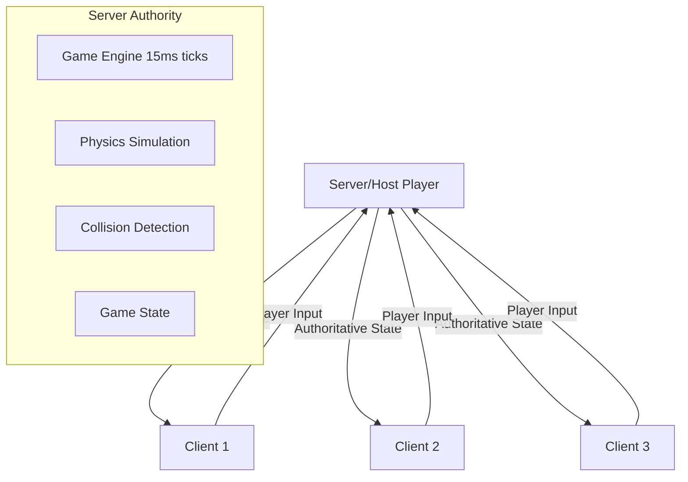

# Real-time Synchronization

Tactics Clash 2D achieves smooth multiplayer gameplay through a sophisticated real-time synchronization system. The game runs at 67 FPS (15ms ticks) on the server with continuous state updates streamed to clients via WebRTC data channels.

## Synchronization Architecture

### Authority Model


**Server (Host) Responsibilities**:
- Runs authoritative game engine at 15ms intervals
- Processes all player inputs
- Simulates physics and collisions
- Broadcasts state updates to all clients

**Client Responsibilities**:
- Send player inputs to server
- Receive and apply state updates
- Handle local rendering and UI
- Predict movement for responsiveness

## Game Engine Tick System

### Core Game Loop
```javascript
class GameController {
    tickTimePeriod = TICKMS; // 15ms = ~67 FPS
    
    start() {
        this.stop();
        this._tickInterval = setInterval(this.tickMaybe.bind(this), this.tickTimePeriod);
    }
    
    tickMaybe() {
        if (!this.isProcessingTick) {
            this.tick();
        }
    }
    
    tick() {
        this.isProcessingTick = true;
        
        // Process all game objects
        this.projectiles.forEach(this.tickProjectile.bind(this));
        this.actors.forEach(this.tickActor.bind(this));
        
        // Execute scheduled callbacks
        this.doOnTick.forEach(todo => todo());
        
        this.isProcessingTick = false;
    }
}
```

### Tick Rate Performance
- **Target**: 67 FPS (15ms intervals)
- **Protection**: Skip tick if previous still processing
- **Consistency**: Fixed timestep for predictable physics
- **Callbacks**: `doOnTick` array for synchronized operations

## State Synchronization

### Server State Updates
The server broadcasts game state changes after each tick:

```javascript
handleTick() {
    // Send state delta to all clients
    this.server.send({
        action: 'tickUpdate',
        data: this.formatGameUpdate()
    });
}

formatGameUpdate() {
    return this._formatGameState(this.levelRef.getUpdate());
}
```

### Client State Application
Clients receive and apply updates immediately:

```javascript
handleTick(data) {
    // Update level state (environment, projectiles)
    this.levelRef.updateState(data);
    
    // Update all player actors
    Object.keys(data.actors).forEach(uid => {
        let playerData = data.actors[uid];
        let player = this.players[uid];
        
        if (player && player.actor) {
            player.actor.x = playerData.x;
            player.actor.y = playerData.y;
            player.actor.rotation = playerData.rotation;
            player.actor.health = playerData.health;
            player.actor.maxHealth = playerData.maxHealth;
            player.actor.ammo = playerData.ammo;
            player.actor.maxAmmo = playerData.maxAmmo;
            player.actor.isDead = playerData.isDead;
        }
    });
}
```

## Input Synchronization

### Client Input Capture
Player inputs are captured and sent continuously:

```javascript
updateUserControlls() {
    let checkString = JSON.stringify(this.controllableActor.controller);
    if (checkString !== this.savedUserControlls) {
        this.client.send({
            action: 'updateActorController',
            data: this.controllableActor.controller.getSerializable()
        });
        this.savedUserControlls = checkString;
    }
}
```

### Server Input Processing
Server receives and applies inputs with throttling:

```javascript
updateControls(data) {
    this._updateCtrlData = data;
    if (!this._updateCtrlInterval) {
        // Apply controls immediately
        this.actor.controller.setSerializable(this._updateCtrlData);
        
        // Throttle to 20ms intervals
        this._updateCtrlInterval = setTimeout(
            () => this._updateCtrlInterval = null, 
            updateControlsDebounce
        );
    }
}
```

### Input Types
```javascript
// Movement controls
isMovingForward: boolean
isMovingRight: boolean  
isMovingLeft: boolean
isMovingBackwards: boolean
isSprinting: boolean

// Combat controls
isFiring: boolean
isReloading: boolean

// Aim direction
facePotentialPosition(x, y)
```

## Actor Synchronization

### Movement Processing
Each tick, the server processes all actor movements:

```javascript
tickActor(actor) {
    if (!actor.isDead) {
        actor.tickCooldowns();
        
        // Process movement inputs
        if (actor.controller.isMovingForward) {
            actor.stepForward(this._level.collisions);
        }
        if (actor.controller.isMovingRight) {
            actor.stepRight(this._level.collisions);
        }
        if (actor.controller.isMovingLeft) {
            actor.stepLeft(this._level.collisions);
        }
        if (actor.controller.isMovingBackwards) {
            actor.stepBackwards(this._level.collisions);
        }
        
        // Update facing direction
        actor.faceFromPotential();
        
        // Process combat actions
        if (actor.controller.isReloading) {
            actor.actionReload();
        } else if (actor.controller.isFiring) {
            actor.actionFire();
        }
    }
}
```

### State Delta Optimization
Only changed actor properties are synchronized:

```javascript
_formatGameState(state) {
    return {
        actors: state.actors,        // Only modified actors
        projectiles: state.projectiles, // Active projectiles
        level: state.levelChanges    // Environmental changes
    };
}
```

## Projectile Synchronization

### Physics Simulation
Projectiles are simulated server-side with full ballistics:

```javascript
tickProjectile(projectile) {
    projectile.move(this._level.hitCollisions);
}
```

**Features**:
- **No Hitscan**: Full ballistic trajectory simulation
- **Collision Detection**: Against environment and players
- **Persistence**: Projectiles exist until impact or timeout
- **Synchronization**: All clients receive projectile updates

### Projectile Data Structure
```javascript
{
    id: uniqueIdentifier,
    x: position.x,
    y: position.y,
    velocityX: velocity.x,
    velocityY: velocity.y,
    damage: damageValue,
    ownerId: shooterPlayerId
}
```

## Network Optimization

### Update Throttling
- **Control Updates**: 20ms minimum interval
- **State Snapshots**: Every 15ms (tied to tick rate)  
- **Delta Compression**: Only send changes
- **Priority Messages**: Critical events sent immediately

### Bandwidth Management
```javascript
// State differentials instead of full snapshots
getUpdate() {
    return {
        actors: this.getModifiedActors(),
        projectiles: this.getActiveProjectiles(),
        environmental: this.getLevelChanges()
    };
}
```

### Message Prioritization
1. **Critical**: Player death, game state changes
2. **High**: Player positions, projectile spawns
3. **Normal**: Score updates, UI changes
4. **Low**: Environmental effects

## Lag Compensation

### Client-Side Prediction
While not fully implemented, the architecture supports:
- **Input Prediction**: Apply movement immediately on client
- **Server Reconciliation**: Correct prediction errors when server state arrives
- **Rollback**: Handle mispredictions gracefully

### Latency Handling
- **Direct Connections**: WebRTC minimizes network hops
- **Buffering**: Small input buffer to smooth network hiccups
- **Timeout Detection**: Disconnect clients with excessive lag

## Synchronization Challenges

### Common Issues
1. **Network Jitter**: Variable message delivery times
2. **Packet Loss**: Missing state updates
3. **Clock Skew**: Different tick timing on host vs clients
4. **Input Lag**: Delay between input and server response

### Mitigation Strategies
```javascript
// Message ordering
this.connection.ordered = true;

// Reliable delivery
this.connection.reliable = true;

// Timeout handling
this.connection.on('close', () => {
    this.controller.disconnected();
});
```

## Performance Monitoring

### Metrics Tracked
- **Tick Duration**: Time to process each game tick
- **Network RTT**: Round-trip time for messages
- **Update Frequency**: Actual vs target update rate
- **Memory Usage**: Game state size growth

### Performance Tuning
```javascript
const TICKMS = 15;              // 67 FPS target
const updateControlsDebounce = 20; // Input throttling
const CHECKTS = 1000;           // Session state monitoring
```

## Error Recovery

### Connection Issues
- **Reconnection**: Full state resync on reconnect
- **Partial Updates**: Handle incomplete state messages
- **Timeout Recovery**: Remove unresponsive players

### State Corruption
- **Validation**: Server validates all inputs
- **Rollback**: Reset to last known good state
- **Graceful Degradation**: Continue with reduced functionality

This synchronization system provides the foundation for smooth, responsive multiplayer gameplay while maintaining consistency across all connected players.