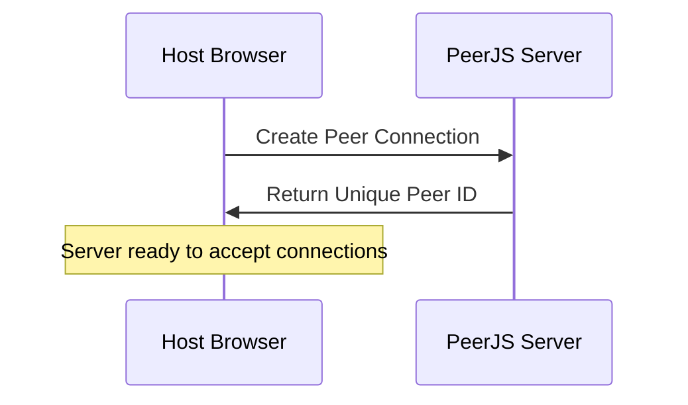
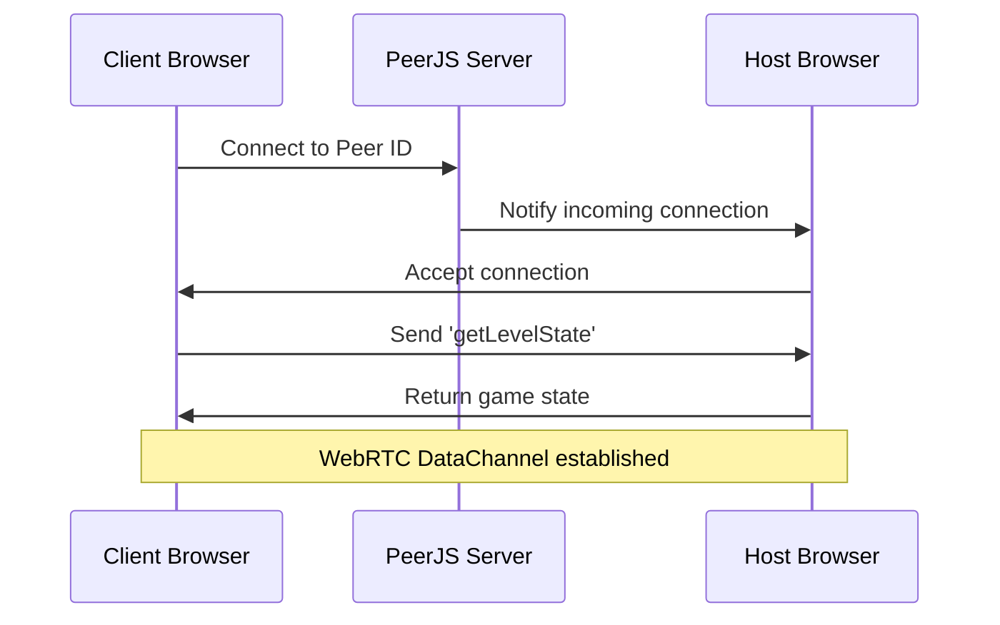

# WebRTC Networking

Tactics Clash 2D uses WebRTC (Web Real-Time Communication) technology for peer-to-peer connections, implemented through the PeerJS library. This enables direct browser-to-browser communication without requiring a central game server.

## WebRTC Implementation

### Libraries Used
- **PeerJS v0.3.14**: Simplifies WebRTC peer connections
- **WebRTC DataChannels**: For real-time game data transmission

### Connection Services

#### Server Connection Service (`src/app_modules/services/server.connection.service.js`)

```javascript
class ServerConnectionService {
    peer = new Peer(null, { key: peerApiKey });
    connections = {};
    
    constructor() {
        this.peer.on('connection', conn => {
            // Handle incoming client connections
            conn.on('open', () => {
                let ind = this.getIndex();
                this.connections[ind] = new ConnectionRef(conn, ind);
                
                conn.on('data', data => this.handleClientMessage(this.connections[ind], data));
                conn.on('close', data => this.controller.deletePlayer(ind));
            });
        });
    }
}
```

**Key Features:**
- Generates unique peer ID for server discovery
- Manages multiple client connections
- Handles connection lifecycle (open/close events)
- Routes messages to appropriate handlers

#### Client Connection Service (`src/app_modules/services/client.connection.service.js`)

```javascript
class ClientConnectionService {
    peer = new Peer(null, { key: peerApiKey });
    
    connect(key) {
        this.connection = this.peer.connect(key);
        this.connection.on('open', () => {
            this.connection.on('data', data => this.handleServerMessage(data));
            this.connection.send({ action: 'getLevelState' });
        });
        this.connection.on('close', () => {
            if (this.controller) {
                this.controller.disconnected();
            }
        });
    }
}
```

**Key Features:**
- Connects to server using peer ID
- Establishes bidirectional data channel
- Handles connection state changes
- Automatically requests game state on connect

## Connection Flow

### 1. Server Initialization


### 2. Client Connection Process


## Message Protocol

### Message Structure
All messages follow a consistent JSON structure:
```javascript
{
    action: 'messageType',
    data: { /* payload */ }
}
```

### Server-to-Client Messages

| Action | Purpose | Payload |
|--------|---------|---------|
| `levelState` | Initial game state | Level data, players, weapons |
| `tickUpdate` | Real-time game updates | Actor positions, health, projectiles |
| `playerConnected` | Player join notification | Player ID and name |
| `playerDisconnected` | Player leave notification | Player ID |
| `spawnActor` | Create player character | Position, team, weapon |
| `gameSessionState` | Game phase changes | 'lobby', 'play', 'finish' |
| `sessionScore` | Score updates | Team scores and winner |

### Client-to-Server Messages

| Action | Purpose | Payload |
|--------|---------|---------|
| `getLevelState` | Request game state | None |
| `registerPlayer` | Join game | Name, weapon, team |
| `updateActorController` | Send player input | Movement, shooting controls |

## Connection Management

### ConnectionRef Class
Each client connection is wrapped in a `ConnectionRef` object:

```javascript
class ConnectionRef {
    constructor(conn, id) {
        this.connection = conn;
        this.id = id;
        this.connectedAt = Date.now();
    }
    
    send(data) {
        this.connection.send(data);
    }
    
    updateControls(data) {
        // Throttled control updates (20ms debounce)
        this._updateCtrlData = data;
        if (!this._updateCtrlInterval) {
            this.actor.controller.setSerializable(this._updateCtrlData);
            this._updateCtrlInterval = setTimeout(
                () => this._updateCtrlInterval = null, 
                updateControlsDebounce
            );
        }
    }
}
```

### Connection State Management
- **Connection Tracking**: Server maintains `connections` object with all active clients
- **Cleanup**: Automatic cleanup on disconnect events
- **Player Removal**: Notifies game controller when players leave

## Data Channels Configuration

### Channel Settings
- **Ordered**: Messages arrive in send order
- **Reliable**: Guaranteed delivery (TCP-like)
- **Binary Support**: For potential future optimizations

### Performance Optimizations
- **Control Debouncing**: Player input updates throttled to 20ms intervals
- **State Differentials**: Only changed game state data sent in updates
- **Connection Reuse**: Single persistent connection per client

## Network Requirements

### Firewall/NAT Traversal
- **STUN Servers**: Used for NAT traversal (provided by PeerJS)
- **Direct Connections**: Most connections establish directly
- **Fallback**: PeerJS handles connection establishment failures

### Browser Compatibility
- **Modern Browser Support**: Chrome, Firefox, Safari, Edge
- **WebRTC Support**: Required for all participants
- **Local Network**: Works on same LAN without internet

## Error Handling

### Connection Failures
```javascript
conn.on('error', (err) => {
    console.error('Connection error:', err);
    // Cleanup and notify user
});

conn.on('close', () => {
    // Remove player from game
    this.controller.deletePlayer(connectionId);
});
```

### Reconnection Strategy
- **No Automatic Reconnection**: Players must manually reconnect
- **Game State Recovery**: Full state sync on reconnection
- **Host Migration**: Not supported - game ends if host leaves

## Security Considerations

### Trust Model
- **Host Authority**: Host player has complete game authority
- **Client Validation**: Server validates all client inputs
- **No Encryption**: WebRTC provides transport security

### Potential Vulnerabilities
- **Host Cheating**: Host can manipulate game state
- **Input Manipulation**: Clients could send invalid input
- **DoS Attacks**: Malicious clients could flood messages

## Performance Monitoring

### Connection Metrics
- **RTT**: Round-trip time for message delivery
- **Bandwidth**: Data channel utilization
- **Connection Count**: Number of active clients

### Optimization Techniques
- **Message Batching**: Multiple updates per message
- **Priority Queuing**: Critical messages sent first
- **State Compression**: Minimal data structures